# one-redstone-server-datapack
## 物品可再生:
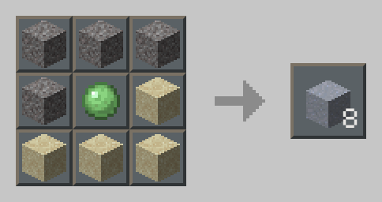  
粘液球/蜂蜜瓶,沙子/红沙  
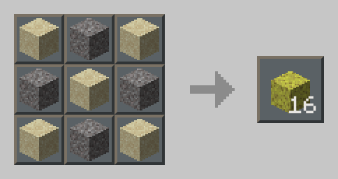  
沙子/红沙  
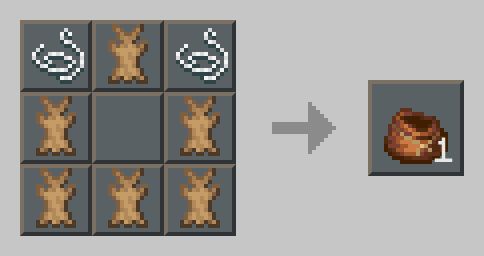  
皮革/兔子皮  
  
钻石/金锭/铁锭/皮革  
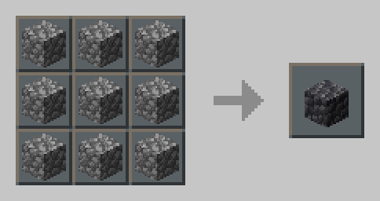  
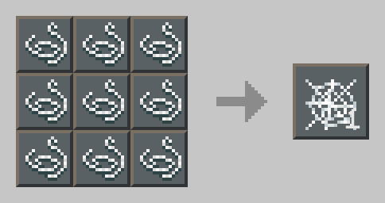  
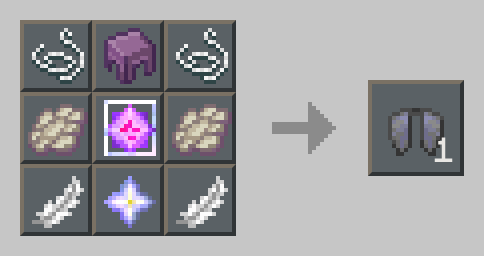  
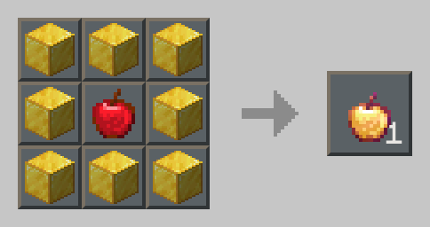  
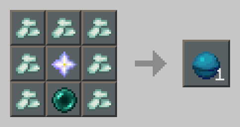  
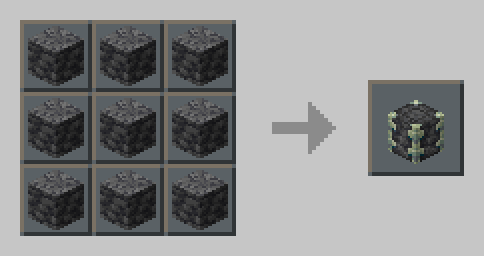  
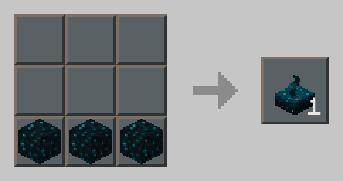  
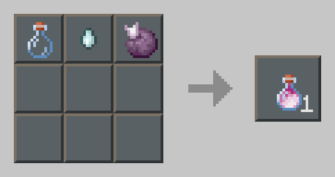  
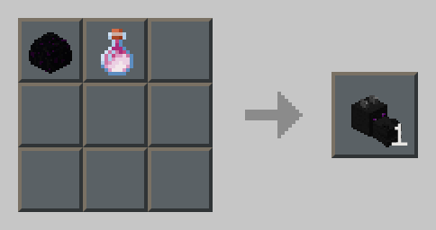  
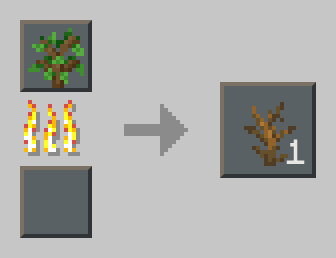  
***
## 增加物品配方:
### 黑石/深板岩圆石可以用来合成红石部件:
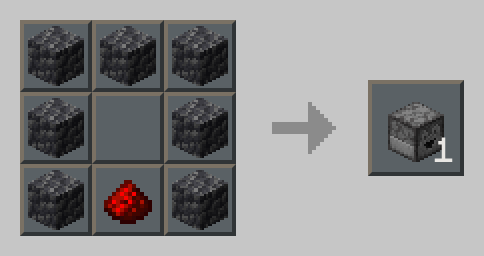  
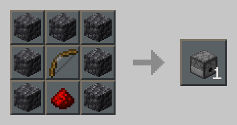  
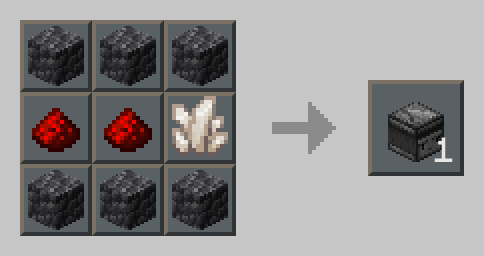  
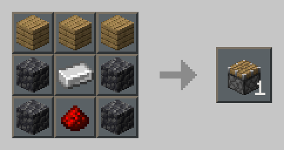  
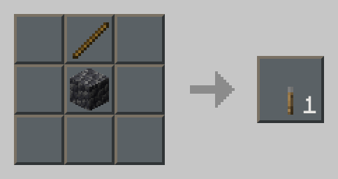  
### 让合成更方便:
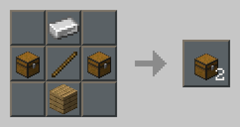  
任意木板  
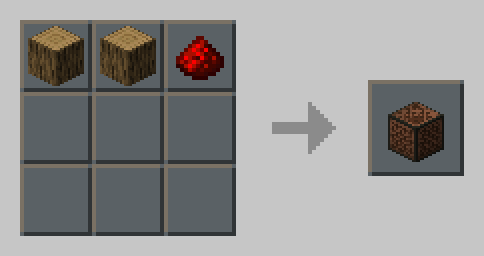  
任意原木  
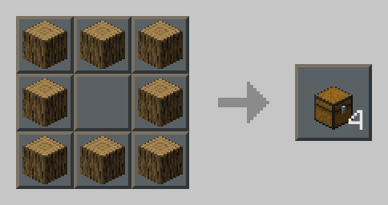  
任意原木  
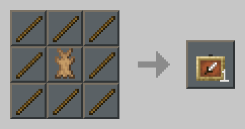  
皮革/兔子皮  
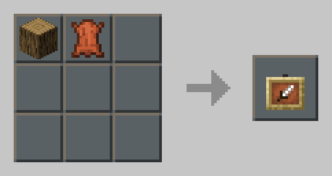  
任意原木,皮革/兔子皮  
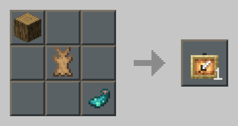  
任意原木,皮革/兔子皮  
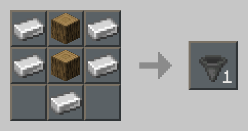  
任意原木  
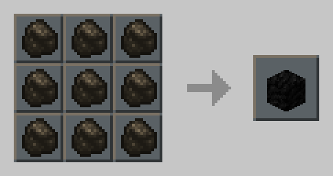  
  
  
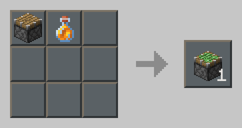  
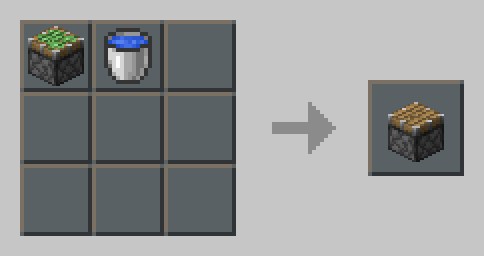  
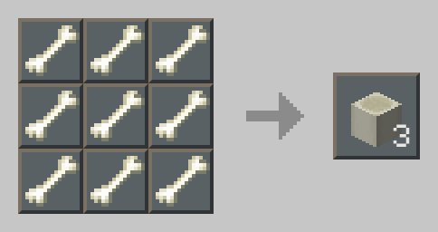  
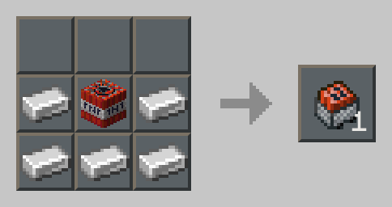  
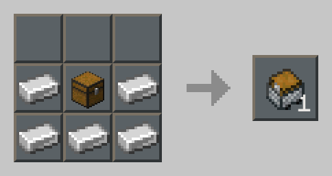  
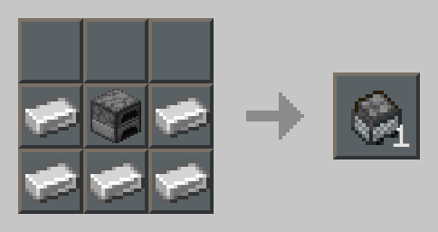  
  
### 不用工作台也可以合成某些物品:
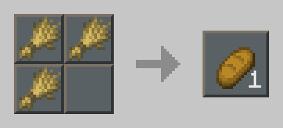  
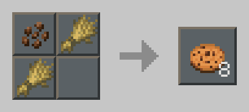  
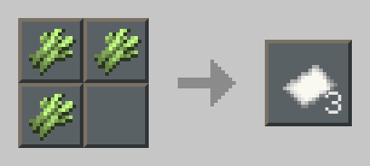  
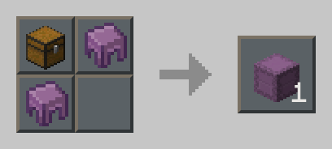  
### 切石机配方:
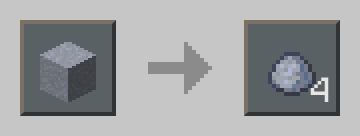  
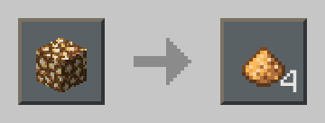  
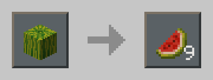  
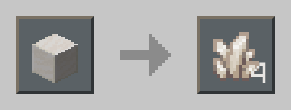  
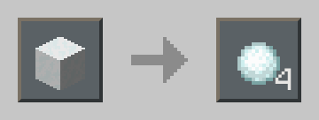  
### 已染色物品可以重新染色并用水桶去掉颜色:
床  
潜影盒  
陶瓦  
羊毛  